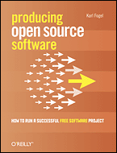

# producing-oss-chinese
> This repository is an attempt to translate the book "[Producing Open Source Software](https://producingoss.com/)" by [Karl Fogel](http://www.red-bean.com/kfogel/) into Chinese with LLMs. The rest of the docs will be written in Chinese.


## 介绍

> 下载 epub, 不同尺寸的 pdf 和 html 版本的电子书 [请点我](https://github.com/t41372/producing-oss-chinese/releases/latest)。也可以直接看[在线版](https://t41372.github.io/producing-oss-chinese/)。

本仓库的目标是利用 LLM 将 Karl Fogel 的著作《制造开源软件: 如何运作一个成功的自由软件项目》([Producing Open Source Software: How to Run a Successful Free Software Project](https://producingoss.com/)") 翻译成中文。





这本书翻译时，我们 (我和 AI) 的假设是你至少看得懂一些英文，因此我们会保留人名和许多术语的英文原文，这对程序员来说可能比奇怪的翻译更熟悉。我认为这本书的目标受众是看得懂英文的 - 甚至能看得懂英文原版，只是读原文书太累。


原始 svn 仓库
- https://svn.red-bean.com/repos/producingoss/trunk/

原文官网
- https://producingoss.com/

协议: Attribution-ShareAlike 4.0 International

原作者: Karl Fogel

## 版本
中文翻译目前基于英文版:
- last changed revision: `3312`
- `2024-09-26T19:24:18.100647Z`

<details>
<summary>
在不安装 svn 的状况下快速检查 svn 原版仓库当前版本的命令:
</summary>
可以用下面这个命令获取 svn 仓库 en 版本的最新 revision 号，以此检查我们的翻译是否需要更新。

```sh
curl -i -s -X PROPFIND \
     -H "Depth: 0" \
     -H "Content-Type: text/xml" \
     -d '<?xml version="1.0"?><D:propfind xmlns:D="DAV:"><D:prop><D:version-name/><D:creationdate/></D:prop></D:propfind>' \
     https://svn.red-bean.com/repos/producingoss/trunk/en/ \
     | grep -E "SVN-Repository-Revision|version-name|creationdate"
```
</details>


## 协议
翻译版保持原书协议，以 Creative Commons Attribution-ShareAlike License 开源，具体请查看 LICENSE 文件或原书仓库中的协议文件。

### 关于字体
中文版的 pdf 采用[思源黑体 (Source Han Sans) 字体](https://github.com/adobe-fonts/source-han-sans)，该字体以 SIL OPEN FONT LICENSE Version 1.1 开源。详情请参考它们的仓库。


## 为什么不贡献回原始仓库？
因为我不会用 svn (而且没打算学)。

另外，原版那边就有一个中文翻译版了。虽然质量一般，但终归是人类翻译出来的成果。LLM 输出的成果本身不算可靠，还需要更多审核工作来确保成果的可靠性。

<details>
<summary>碎碎念和为什么做这个工作</summary>
尽管这本书已经有了官方译本，但我对那个版本并不满意。我本人中文阅读水平较低，对翻译质量十分敏感。我是在飞机上读到这本书的，当时气得不行，心想与其费劲巴拉地去研究那如同攀登巴别塔般的中文翻译，还不如直接读英文版来得快，然后我就去读英文版了。下飞机之后气不过，就开始了这个项目。

我们正处于华人开源社区崛起的时代，新一代开发者正在成长。这本书本身是无价之宝，但翻译却十分不理想。我们得做点什么才行。

但我的中文文学水平实在不敢恭维 (简单来说就是不如机翻)。如果让我自己翻译这本书，远达不到令人满意的程度。不如用 LLM 来翻译这本书。我恰好有一些 AI coding assistant 的订阅，连 API 钱都不用付。

LLM 并不完美。实际上，它们相当糟糕。为了省钱，我没用 LLM API。我使用了以下工具来完成这本书
- Google Jules (Gemini 2.5 Pro 和 3.0 Pro)，基本整本书都是用 jules 写的。Gemini 3.0 负责了后期的审核和润色。
- Claude 4.5 Sonnet (Claude code web 限时送了 250 刀，拿来用了会儿，但满意度一般)
- GPT5, GPT5.1, GPT5-Codex, GPT5.1-Codex 用来配置环境，搭建配套设施，写一些脚本，做代码审核。这玩意儿的中文写作能力比较难评，而且在本次任务中，长上下文出现了严重的幻觉，做审核时结果错的很离谱。但写代码还是相当可靠的。

为了避免 AI 翻译 xml 把格式搞烂，我让 AI 弄了些 github actions 检查。除此之外，有各种 AI 审核机制，但我发现代码审核工具在此次任务下并不理想。于是我让 AI 写了个 Python 脚本来生成用来审核翻译结果的提示词文本 (是的调用 API 是不可能调用的。我一分钱也不会花的)。为了应对 Gemini-3-Pro-Preview 的上下文问题，我额外进行了优化。

这个 GitHub 仓库中的工具链大多是从原始 svn 仓库拉回来的，有些是我自己 (我让AI) 写的。由于原始项目太大，而且我不会用 svn (也没打算学)，我只选择性的从原项目仓库拿了一些必要的东西。坦白说，不知道之后原书更新之后要怎么处理变化，不过总有办法的。

整体流程:

0. 让各种 AI coding assistant 尝试进行翻译，但效果不佳。
1. 让 Jules 做了第一版翻译，让 jules 和其他 AI 助手做了一些 code review。翻译效果不错，审核效果较差。
2. 用脚本生成中英文对照的审核材料，提交给 gemini 3.0 审核。
3. 之后继续重复审核和修改的流程，直到质量达标到可以发布的程度

</details>

---
---

## 构建指南

翻译内容完成后，可以借助项目内置的 Docker 化工具链把整本书打包为 HTML、EPUB 与 PDF。整个流程不会在宿主机上安装 DocBook/FOP，只需要 Docker。

这个仓库中的 GitHub action 使用 docker 工具链构建书籍并更新 GitHub page。

如果你更希望直接使用本机已经安装好的 DocBook/FOP 工具链，也可以运行新的 `scripts/build-book-local.sh`，完全跳过 Docker（见下文“本地工具链”）。

<details>
<summary>关于帮 AI 配环境</summary>

如果你使用的远程 AI 恰好不能用 docker，恰好使用 debian/ubuntu 系的虚拟机，可以使用下面这个简单命令一键帮他配环境。

```sh
sudo apt-get update && sudo apt-get install -y make subversion xsltproc docbook-xsl docbook-xsl-ns fop default-jre-headless zip python3 libxml2-utils
```

</details>

<details>
<summary>快速开始</summary>

1. 确保本机已安装并启动 Docker Desktop（或其他兼容的 Docker 守护进程）。
2. 在仓库根目录执行：

   ```bash
   ./scripts/build-book.sh zh
   ```

   脚本会：
   - 根据 `docker/builder.Dockerfile` 构建一个包含 `xsltproc`、DocBook XSL、Apache FOP、fonts-noto-cjk 等依赖的容器镜像；
   - 在容器里自动下载官方 `tools/`、`lang-makefile`、`styles.css`；
   - 用当前 Git 提交信息生成 `book/zh/book.xml`；
   - 依次运行 `html html-chunk epub pdf` 四个 `make` 目标，产出 `book/zh/producingoss.html`、`book/zh/html-chunk/`、`book/zh/producingoss.epub` 与各纸张尺寸的 PDF。

### 本地工具链（不使用 Docker）

如果不使用 docker，请确保环境中已经安装相关依赖:
```sh
sudo apt-get update && sudo apt-get install -y make subversion xsltproc docbook-xsl docbook-xsl-ns fop default-jre-headless zip libxml2-utils
```

若你的环境里已经安装好 DocBook/FOP 相关依赖，可以直接运行：

```bash
./scripts/build-book-local.sh zh
```

该脚本会重用 `scripts/internal/build-inside-container.sh`，步骤与 Docker 版完全一致，但所有命令都在宿主机执行。请先准备好以下工具（名称以 Debian/Ubuntu 软件包为例）：

- `make`
- `svn`
- `xsltproc` 与 `docbook-xsl`/`docbook-xsl-ns`
- `fop`（包含 `default-jre-headless`）
- `zip`、以及 `libxml2-utils`

如果只想生成某些格式，可以和 Docker 方案一样通过 `BUILD_TARGETS` 环境变量覆盖默认值；`POSS_SVN_BASE`、`FOP_OPTS`、`HTML_CHUNK_DIR_OVERRIDE` 等变量同样受支持。

### 可选参数

- 切换语言：`./scripts/build-book.sh en zh` 会顺序构建 `book/en` 与 `book/zh`。
- 覆盖构建目标：`BUILD_TARGETS="html epub" ./scripts/build-book.sh zh`。
- 自定义镜像标签或 Dockerfile：通过 `POSS_BUILDER_IMAGE`、`POSS_DOCKERFILE` 环境变量控制。

### GitHub Actions 自动构建

`.github/workflows/build-book.yml` 会在相关文件变更或手动触发时运行同一套脚本，并把生成的 HTML/EPUB/PDF 作为构建工件（artifact）上传，方便下载或后续部署。

### 构建产物位置

所有生成文件位于 `book/<语言代码>/` 目录下：

- 单页 HTML：`producingoss.html`
- 分片 HTML 目录：`html-chunk/`
- EPUB：`producingoss.epub`
- 多种纸张规格的 PDF：`producingoss-*.pdf`

如需发布到网站，可直接将 `html-chunk/` 与 `producingoss.html` 上传到静态站或 GitHub Pages。

</details>

## 一些相关的 prompt

<details>

一些跟 setup 相关的 prompt 在下面。翻译用的 prompt 在 agents.md 里面。

### context doc prompt
```markdown
We will be deligating the translation work of the book "Producing Open Source Software:

How to Run a Successful Free Software Project" by Karl Fogel into different languages. Please write a detailed translation guide to let the translators know about the context of the entire book (lots of translators will work on discrete pages).
```


### setup prompt

```markdown

下面是 setup 这本书翻译工作的官方指南。
我们不打算用 svn，也不打算推回到原始的仓库了，只打算把档案拿到之后放在我们当前的 git 里面。
我们要翻译的是英翻中，但我们完全不打算使用旧的中文翻译，所以我们应该要先拿到英文的 source，然后再把它翻译成中文。

~~~markdown
Translator guidelines:

These guidelines assume you're familiar with using the Subversion version control system. If you're not, don't worry: we'll find a way to make it easy for you to work on the translation, either by teaching you some Subversion, or by arranging things so that you don't have to use Subversion.

First, get a username and password for repository access by asking here. Then check out a working copy of the relevant translation directory, named after the two-letter standard language code. In this example, it's zh for Chinese:

   $ svn checkout http://svn.red-bean.com/repos/producingoss/trunk/zh/
   $ cd zh
The chapters are named ch00.xml, ch01.xml, etc (and there are a few other XML files, for the table of contents and the appendices). Just edit each file, replacing English text with the target language. (If your software asks you what format to save in, choose "UTF8" or "UTF-8".)

Once you've done enough work and you're ready to save, commit the changes to the repository:

   $ svn commit -m "Translated some more of Chapter 2." ch02.xml
At any time, you can "update" to bring down the changes other people may have made:

   $ svn update
You can use the ViewVC tool here just to check if your work is there or to see the modifications list and differences between them.


~~~

所以我们要怎么做呢？要怎么拿到所有英文的源文件然后开始翻译工作？
顺便帮我规划一下我们这个 git 仓库的 layout。目前我的规划是 root 放一些跟我们翻译工作相关的东西，书的源文件和翻译放在 book 目录下。
```


</details>


